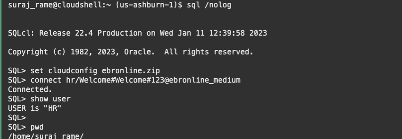
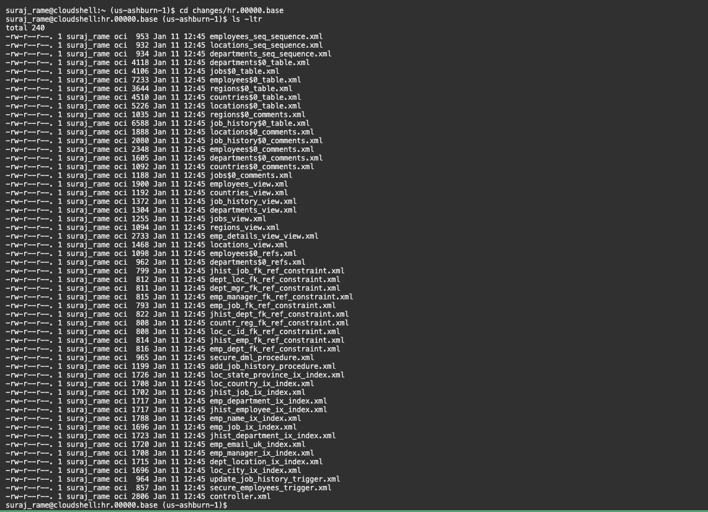

# Generate the base changelog for liquibase

Estimated lab time: 10 minutes

### Objectives

In this lab, you will learn how to use Liquibase  to generate the base changelog of HR Schema.

Liquibase is an open-source database-independent library for tracking, managing and applying database schema changes.

In SQLcl, you can now execute commands to generate a changelog for a single object or for a full schema (changeset and changelogs). You can process these objects manually using SQLcl or through any of the traditional Liquibase interfaces.

With the Liquibase feature in SQLcl, you can:

    Generate and execute single object changelogs
    Generate and execute schema changesets with object dependencies
    Automatically sort a changeset during creation based on object dependencies
    Record all SQL statements for changeset or changelog execution, as it is generated
    Provide full rollback support for changesets and changelogs automatically

## Task 1: Run lb generate-schema to generate the base changelog

The command `lb generate-schema` creates the base Liquibase changelog. Login to HR schema and verify the current working directory is home path of Cloud Shell. You have to make sure to run the lb generate-schema command from ***changes/hr.00000.base*** directory:

```text
suraj_rame@cloudshell:~ (us-ashburn-1)$ pwd
/home/suraj_rame
suraj_rame@cloudshell:~ (us-ashburn-1)$ 
```

***Home folder will be different for you***

```text
<copy>sql /nolog</copy>
```

```text
<copy>set cloudconfig ebronline.zip</copy>
<copy>connect hr/Welcome#Welcome#123@ebronline_medium</copy>
<copy>show user</copy>
<copy>pwd</copy>
```



Change directory, remove existing files and run lb generate-schema

```text
<copy>cd changes/hr.00000.base</copy>
<copy>! rm -rf *.*</copy>
<copy>lb generate-schema</copy>
```


This initial changelog is useful if you plan to recreate the schema from scratch by using `Liquibase` instead of the base scripts.
Notice that the `HR` schema creation is not included in the changelog.

The Liquibase changelog is created as a set of xml files:

```text
<copy>cd changes/hr.00000.base</copy>
<copy>ls -ltr</copy>
```



The `controller.xml` is the changelog file that contains the changesets. Open the file and you can see that the changesets are called from the current path 


You have successfully genereated the schema log using Liquibase for the HR schema [proceed to the next lab](#next)

## Acknowledgements ##

- Author - Ludovico Caldara and Suraj Ramesh 
- Last Updated By/Date -Suraj Ramesh, Jan 2023
